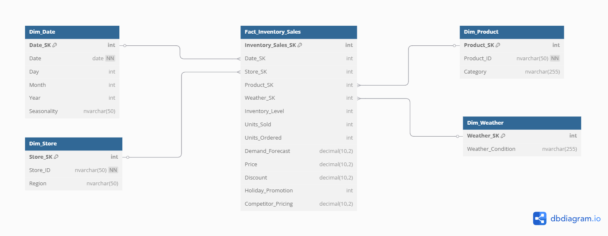
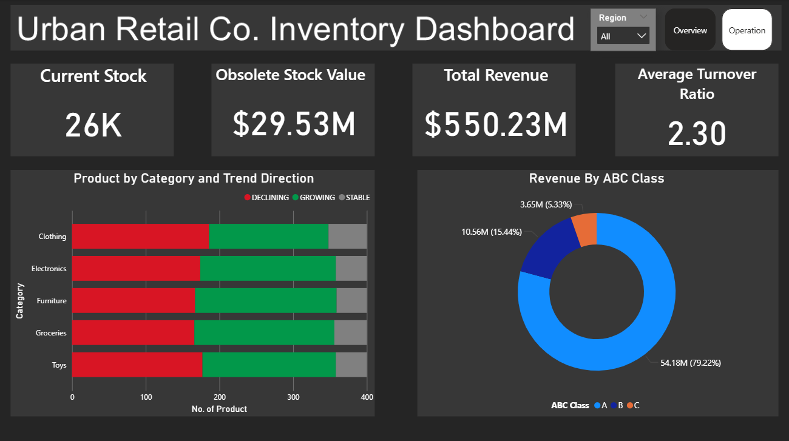
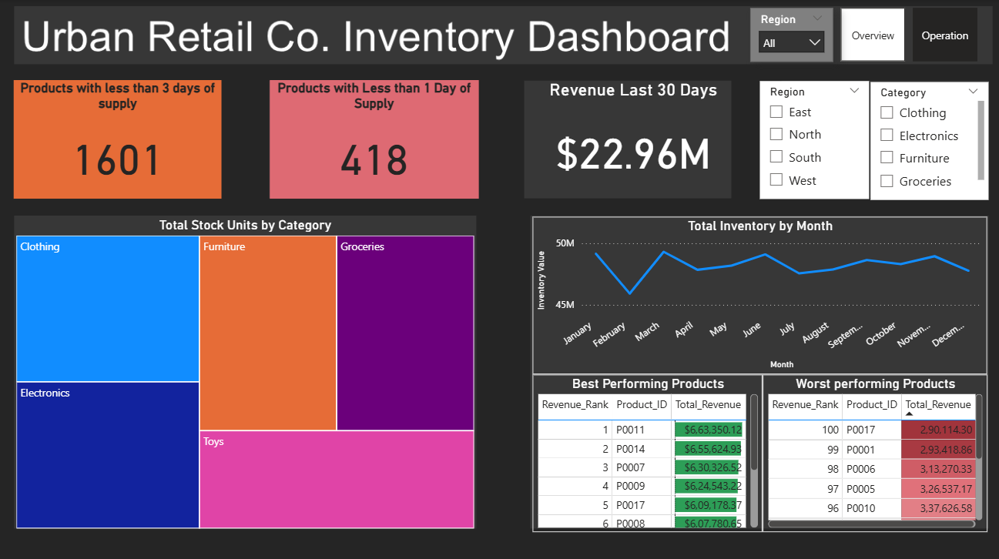

# SQL-Based Inventory Optimization for Urban Retail Co.

## Project Overview

This project is a comprehensive analysis of a retail company's inventory, sales, and supply chain data. I acted as a data analyst for the fictional "Urban Retail Co." to solve critical business challenges related to inventory inefficiency. The project involved designing a database from the ground up, performing ETL, and using advanced SQL queries to uncover actionable insights that directly impact profitability and customer satisfaction.

---

## 🎯 The Business Challenge

Urban Retail Co., a growing retail chain, was facing significant financial and operational issues due to a lack of data-driven decision-making. The primary challenges were:
* **Lost Sales** from frequent stockouts of popular products.
* **Trapped Working Capital** due to overstocking of slow-moving items.
* **Poor Visibility** into performance across different product categories, stores, and suppliers.

---

##  Our Solution & Approach

My approach was to build an end-to-end analytical solution using SQL to provide clarity and drive strategic action.

1.  **Database Engineering:** I designed and implemented a robust relational database using a **Star Schema**. This involved normalizing the raw data to reduce redundancy and indexing all key columns to ensure high-speed query performance for analytics.

2.  **ETL Process:** I developed a script to Extract, Transform, and Load the raw CSV data into the newly designed database, ensuring data integrity and consistency.

3.  **Data Analysis with SQL:** I wrote a suite of over 20 advanced SQL queries, organized by theme, to perform deep-dive analysis. This included using **CTEs, Window Functions, Statistical Aggregates, and Complex Joins** to calculate key business metrics.

4.  **Actionable Insights:** I translated the complex query results into clear, quantifiable findings and developed a set of strategic recommendations for the business.

---

## 💻 Tech Stack & Key Concepts

* **Database:** Microsoft SQL Server
* **Querying & IDE:** SQL Server Management Studio (SSMS)
* **Dashbaord:** Microsoft PowerBI 
* **Key SQL Concepts:**
    * Advanced Joins & Subqueries
    * Common Table Expressions (CTEs)
    * Window Functions (`ROW_NUMBER`, `RANK`, `SUM() OVER`)
    * Statistical Aggregates (`AVG`, `STDEV`)
    * Conditional Aggregation (`CASE` statements)
    * Database Design (Star Schema, Normalization, Indexing)

---

## 🖼️ Visuals

### Database Design (ERD)
The database was designed with a Star Schema to optimize analytical queries. The central fact table holds quantitative data, while the dimension tables hold descriptive attributes.

### KPI Dashboard Mockup
The final output of the analysis is a comprehensive KPI dashboard designed for executive review and operational management. It provides an at-a-glance view of the most critical inventory metrics.

---

## 📈 Repository Structure

### Repository Contents 

* **`Sql_Scripts/`**: Contains SQL scripts.
    * **`schema_and_etl/`**: Contains the  scripts to build and populate the database.
    * **`analysis_queries/`**: Contains the SQL scripts for Analysis.
* **`analysis reports/`**: Contains Project Report and Executive Summary.
* **`dashboard/`**: Dashboard Pages image.
* **`data/`**: Holds the raw dataset that is source of project.
* **`erd/`**: Contains the Entity-Relationship Diagram.
* **`README.md`**: This file, providing a complete overview and guide to the project.

---
